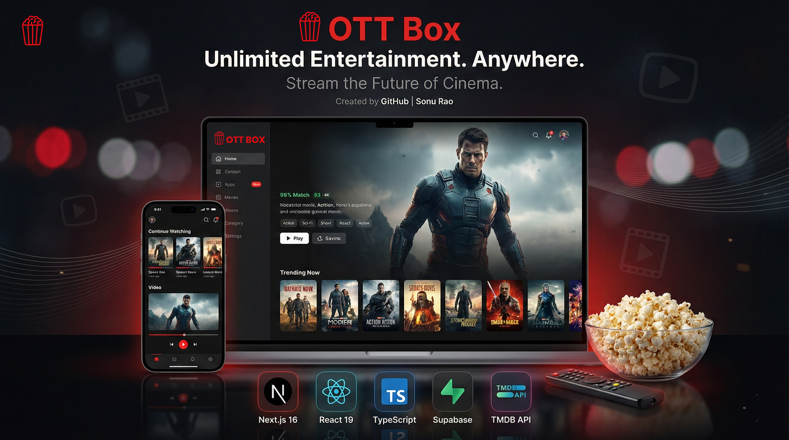
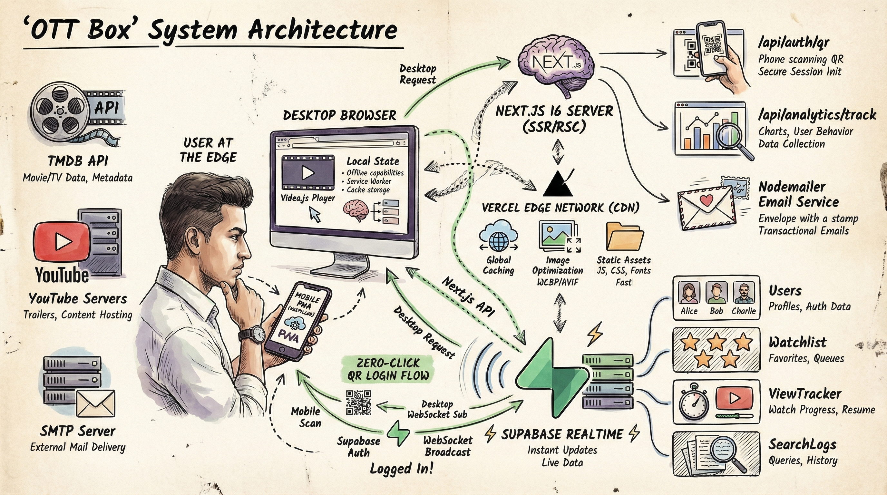

# 🎬 OTT Box - Premium Streaming Experience

<div align="center">
  <h3>⭐⭐ If you find this project useful, please consider giving it a STAR! ⭐⭐</h3>
  <p>It helps the algorithm and motivates me to add more enterprise features!</p>
</div>
<div align="center">
  
  
  <br><br>
  
  <h3>✨ Stream Unlimited. Watch Anywhere. Enjoy Everything. ✨</h3>
  
  <p align="center">
    
    
    
    
    
  </p>
</div>

---

## 🌟 **Project Overview**

**OTT Box** is a premium streaming platform that brings the cinema experience to your screen. Built with cutting-edge Next.js 16 and powered by TMDB API, it delivers a rich, immersive viewing experience with auto-playing trailers, dynamic content discovery, and a sleek Netflix-inspired interface.

### 🔥 **Hot New Features**

- 🔐 **Zero-Click QR Login** - Real-time Netflix-style WebSocket auth from mobile to desktop.
- 💌 **Premium Emailing** - Automated, custom-branded Welcome & Magic Link emails.
- 🛡️ **Secure Magic Links** - Advanced database checks to prevent ghost account creation.
- 🎬 **Shorts/Reels Feed** - Shorts/Reels-style vertical video feed for immersive trailer discovery.
- 🛡️ **Smart Watchlist** - Protected watchlist with authentication and easy management.
- 📱 **PWA Support** - Installable as a native app on all devices.
- 👆 **Touch Interactions** - Swipe, scroll, and long-press gestures optimization.

### 🎯 **Key Features**
 
- 🎥 **Auto-Playing Trailers** - Cinematic hero section with YouTube video backgrounds
- 📱 **Fully Responsive** - Seamless experience across all devices
- 🎭 **Premium UI/UX** - Netflix-style design with glassmorphism effects
- 🔍 **Smart Search** - Real-time content discovery across movies and TV shows
- 🎬 **Dynamic Categories** - Trending, Top Rated, Series, and Genre-based browsing
- ⚡ **Lightning Fast** - Server-Side Rendering with Next.js App Router
- 🎨 **Rich Animations** - Smooth transitions and interactive hover effects
- 📺 **Video Player** - Integrated streaming capabilities
- 🌐 **Multi-Content Support** - Movies, TV Series, Seasons, and Episodes

---

## 🚀 **Live Demo**

<div align="center">
  <a href="https://ott-box-weld.vercel.app/" target="_blank">
    
  </a>
  
  <br><br>
  
  <h4>🎯 <a href="https://ott-box-weld.vercel.app/" target="_blank">👉 Click Here to Visit Live Website 👈</a></h4>
  
  <p><strong>✨ Full streaming experience with unlimited content! ✨</strong></p>
  
  <br>
  
  <a href="https://github.com/SonuPaikrao/ottbox.git" target="_blank">
    
  </a>
</div>

---

## 🛠️ **Tech Stack**

### **Frontend Framework**
- ⚛️ **Next.js 16** - Latest App Router with React Server Components
- 🎨 **React 19** - Server Components & Concurrent Features
- 📘 **TypeScript** - Full type safety throughout the application

### **Backend & Data**
- 🗄️ **Supabase** - Backend as a Service for user management
- 🎬 **TMDB API** - The Movie Database for content metadata
- 🔐 **Authentication** - Secure user authentication with Supabase

### **Styling & UI**
- 🎨 **Vanilla CSS** - Custom design system with CSS Modules
- ✨ **Glassmorphism** - Modern frosted glass UI effects
- 🔹 **Lucide React** - Beautiful, consistent iconography
- 🎭 **Smooth Animations** - CSS transitions and transforms

### **Video & Media**
- 📹 **Video.js** - Professional video player integration
- 🎥 **YouTube Embed** - Trailer playback in hero section
- 🖼️ **Next/Image** - Optimized image loading and caching

---

## 🏗️ **System Architecture**

Our architecture is designed to handle real-time concurrency, secure authentication, and edge-deployed frontend delivery.

<div align="center">
  
  <br>
  
</div>

---

## 📦 **Installation & Setup**

### **Prerequisites**
- Node.js (v18 or higher)
- NPM or Yarn package manager
- Supabase account (free tier available)
- TMDB API key (free registration)

### **Quick Start**

```bash
# 1. Clone the repository
git clone https://github.com/SonuPaikrao/ottbox.git

# 2. Navigate to project directory
cd ott-box

# 3. Install dependencies
npm install

# 4. Setup environment variables
# Create .env.local file and add:
# NEXT_PUBLIC_SUPABASE_URL=your_supabase_url
# NEXT_PUBLIC_SUPABASE_ANON_KEY=your_supabase_anon_key

# 5. Start development server
npm run dev

# 6. Open in browser
# Visit http://localhost:3000
```

### **Environment Variables**

Create a `.env.local` file in the root directory:

```env
# Supabase Configuration
NEXT_PUBLIC_SUPABASE_URL=your_supabase_url_here
NEXT_PUBLIC_SUPABASE_ANON_KEY=your_supabase_anon_key_here

### **Authentication Setup (Important)**
To enable Google Sign-In:
1. Go to **Authentication > Providers** in Supabase Dashboard.
2. Enable **Google**.
3. **In Google Cloud Console**:
   - Create Credentials > OAuth Client ID.
   - **Application Type**: Select **Web application** (NOT Chrome Extension).
   - **Name**: "OttBox Web" or similar.
4. Add **Authorized redirect URIs** in Google Cloud: 
   - `https://wkfynjofytyfpvimlfno.supabase.co/auth/v1/callback`
### **Production & Vercel Setup**
When deploying to Vercel:
1. Go to **Supabase Dashboard > Authentication > URL Configuration**.
2. **Site URL**: Set this to your production URL (e.g., `https://ott-box-weld.vercel.app`).
3. **Redirect URLs**: Add the following:
   - `https://ott-box-weld.vercel.app/**`
   - `http://localhost:3000/**`
   
**Note**: You do NOT need to change anything in Google Cloud Console if you are using the Supabase Callback URL correctly. Just ensure Supabase allows your Vercel domain.


```

---

## 🎨 **Design Features**

### **Visual Design**
- 🎨 **Dark Cinema Palette** - Deep blacks (#0a0a0a), rich purples, and vibrant accents
- 🌟 **Hero Section** - Full-screen video background with auto-playing trailers
- 🎭 **Micro-Interactions** - Hover effects, scale transforms, and smooth transitions
- 📱 **Responsive Grid** - Adaptive layouts for all screen sizes
- 🔍 **Blur Effects** - Strategic use of backdrop filters for depth

### **Typography**
- 🎨 **Display Font** - Bold, cinematic headings
- 📝 **Body Font** - Clean, readable sans-serif
- 🎯 **Hierarchy** - Clear visual distinction between content types

---

## 📁 **Project Structure**

```
ott-box/
├── 📁 public/
│   ├── 🖼️ logo.png              # Brand Logo
│   ├── 🎬 banner.png             # Hero Banner
│   └── 📄 manifest.json          # PWA Configuration
├── 📁 src/
│   ├── 📁 app/                   # Next.js App Router
│   │   ├── 🏠 page.tsx           # Home Dashboard
│   │   ├── 🎬 movies/            # Movies Browsing
│   │   ├── 📺 series/            # TV Series
│   │   ├── 🔍 search/            # Search Page
│   │   ├── 🎥 watch/             # Video Player
│   │   ├── 📖 title/             # Content Details
│   │   └── 🎨 globals.css        # Global Styles
│   ├── 📁 components/            # Reusable Components
│   │   ├── 🧭 Header/            # Navigation Bar
│   │   ├── 🎬 Home/              # Home Components
│   │   │   ├── HeroSection.tsx   # Auto-playing hero
│   │   │   └── ContentRow.tsx    # Scrollable content rows
│   │   ├── 🎞️ MovieCard/         # Movie/Series Card
│   │   └── 🦶 Footer/            # Site Footer
│   ├── 📁 lib/                   # Utilities
│   │   └── 📡 api.ts             # TMDB API Integration
│   └── 📁 context/               # React Context
│       └── 🔐 AuthContext.tsx    # Authentication State
├── 📄 package.json
├── 📄 next.config.ts
├── 📄 tsconfig.json
└── 📄 README.md
```

---

## 🎯 **Key Components**

### **🎬 Hero Section**
- Full-screen video background with YouTube trailers
- Auto-rotation between trending content
- Smooth fade transitions between videos and images
- CTAs for "Play Now" and "More Info"

### **🎞️ Content Rows**
- Horizontally scrollable movie/series cards
- Categories: Trending Today, Top Rated, TV Series, By Genre
- Lazy loading for optimal performance
- Hover effects with scale and elevation

### **🔍 Search & Discovery**
- Real-time search across all content
- Genre-based filtering
- Advanced discovery with sort options
- Responsive grid layouts

### **📺 Video Player**
- Custom video player interface
- Episode selection for TV series
- Playback controls and settings
- Fullscreen support

---

## 🚀 **Deployment**

### **Vercel (Recommended)**
```bash
# Install Vercel CLI
npm i -g vercel

# Login to Vercel
vercel login

# Deploy to production
vercel --prod
```

### **Environment Variables on Vercel**
Add the following environment variables in Vercel Dashboard:
- `NEXT_PUBLIC_SUPABASE_URL`
- `NEXT_PUBLIC_SUPABASE_ANON_KEY`

### **GitHub Integration**
Connect your repository to Vercel for automatic deployments on every push.

---

## 🎬 **Content Categories**

### **🔥 Trending**
- Daily trending movies and TV shows
- Real-time updates from TMDB
- Personalized recommendations

### **⭐ Top Rated**
- Highest-rated films across all time
- Curated collections
- Award-winning content

### **📺 TV Series**
- Popular series with season tracking
- Episode-by-episode viewing
- Binge-worthy collections

### **🎭 By Genre**
- Action & Adventure
- Comedy & Drama
- Sci-Fi & Fantasy
- Horror & Thriller
- Romance & Animation

---

## 🤝 **Contributing**

We welcome contributions! Please follow these steps:

1. 🍴 **Fork** the repository
2. 🌿 **Create** a feature branch (`git checkout -b feature/amazing-feature`)
3. 💾 **Commit** your changes (`git commit -m 'Add amazing feature'`)
4. 📤 **Push** to the branch (`git push origin feature/amazing-feature`)
5. 🔄 **Open** a Pull Request

---

## 📄 **License**

This project is licensed under the **MIT License** - see the [LICENSE](LICENSE) file for details.

---

## 🙏 **Acknowledgments**

- 🎬 **TMDB** - For providing comprehensive movie and TV data
- 🗄️ **Supabase** - For backend infrastructure
- ⚛️ **Next.js Team** - For an amazing framework
- 🎨 **Design Inspiration** - Netflix, Disney+, and other streaming platforms

---

## 👨💻 **Developer**

<div align="center">
  
  **Developed with ❤️ by Sonu Rao**
  
  <br>
  
  <p>
    <a href="https://github.com/SonuPaikrao">💼 GitHub Profile</a>
  </p>
  
  <br>
  
  <p><strong>February 2026</strong></p>
  
</div>

---

<div align="center">
  
  <h3>🎬 Made for Movie & TV Enthusiasts 🍿</h3>
  
  <p>If you love this project, give it a ⭐ star!</p>
  
  <p><strong>Happy Streaming! 📺✨</strong></p>
  
</div>
